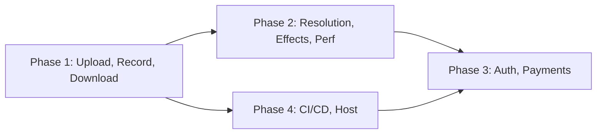

# GlitchLab Pro Upgrade Plan

## Current state

- **Single-file app**: [v2.html](v2.html) — VideoSynth XL Pro Lab, ~1.4k lines (HTML/CSS/JS + WebGL2).
- **Video source**: Camera only via `getUserMedia` (1280×720). No file upload.
- **Record/Download**: Buttons exist in the header but have **no event handlers** — not implemented.
- **Canvas**: Initial size 1280×720 in markup; `fitCanvas()` resizes to stage, so internal resolution follows viewport (not fixed).
- **Pipeline**: WebGL2 with dual FBOs, one main fragment shader (glitch, pixelate, RGB, feedback, hue, palette, sat/bright/contrast, bloom, swirl, ripple, warp, poster, displace, scanlines, invert, strobe, mirror, edge, solarize, slit-scan), presets, fullscreen, hide UI.

---

## Phase 1: Media pipeline (upload, record, download)

**Goal**: Use the same “video screen” for camera **or** uploaded footage, and record/download the **effected** output (what’s on the canvas).

### 1.1 Video source abstraction

- Introduce a single **source of truth** for the current frame used as `u_tex`:
  - **Camera**: keep existing `getUserMedia` → `<video>` (current behavior).
  - **Upload**: `<input type="file" accept="video/*">` → create `<video>` with `URL.createObjectURL(file)`, same aspect-ratio handling and `videoWidth`/`videoHeight` as today.
- In the render loop, sample from either the camera `<video>` or the upload `<video>` (whichever is active). Existing `videoTex` and `gl.texImage2D(..., video)` already support any `<video>` element; you only need to swap which element is bound and ensure `u_texRes` uses that element’s dimensions.
- **UI**: Add an “Upload” (or “Source”) control in the header (e.g. dropdown or buttons: Camera | Upload). When Upload is chosen, show file picker; when a file is selected, use it as source and optionally show filename. Provide “Clear” / “Back to camera” to reset.

### 1.2 Recording (canvas → file)

- **Capture stream**: Use `canvas.captureStream(frameRate)` (e.g. 30 fps) to get a `MediaStream` of the **rendered** canvas (effects included).
- **MediaRecorder**: `new MediaRecorder(stream, { mimeType: 'video/webm;codecs=vp9', videoBitsPerSecond: 5e6 })` (with VP8/Opus fallback if VP9 unsupported). `start()` on RECORD click, `stop()` on second click; collect `ondataavailable` blobs into an array.
- **State**: Toggle RECORD button to “■ STOP” and show a simple “Recording…” indicator. On stop, concatenate blobs, create one `Blob`, store in a variable (or small module-level state) for download.
- **Constraints**: Recording runs in the browser; length limits and performance depend on device. Optionally cap max duration (e.g. 5–10 minutes) and show a warning.

### 1.3 Download

- **Download button**: When the user has a recorded blob (from the last recording), create an object URL and trigger a download with a filename like `glitchlab-YYYY-MM-DD-HH-mm-ss.webm`. If no recording exists, either disable the button or show a short message (“Record first”).
- **Format**: Same as recording (WebM/VP9 or fallback). No server round-trip; purely client-side.

**Files to change**: [v2.html](v2.html) only (or one main JS file if you split later). No backend required for Phase 1.

---

## Phase 2: Visual upgrades and performance

**Goal**: Higher internal resolution, more/better effects, and keep or improve frame rate.

### 2.1 Resolution

- **Render resolution vs display**: Keep display size as today (fit to stage). Add an **internal resolution** (e.g. 1920×1080, optionally 1280×720 / 1080p / 4K in settings).
- **Implementation**: Create canvas at internal size for WebGL (or use a separate offscreen canvas for render). Use the existing FBOs at that size; then either:
  - Blit to a display-sized canvas (CSS size = stage, canvas width/height = internal), or
  - Use a single canvas at internal resolution and scale with CSS (simpler but can be heavy on low-end devices).
- **Presets**: e.g. “720p”, “1080p”, “4K” (or “High”) — set internal width/height and FBO dimensions accordingly. Default 1080p is a good balance.

### 2.2 Cooler / new effects (shader + toggles)

- Add 1–3 new effects in the existing fragment shader (or a second pass if needed):
  - **Chromatic aberration** (radial RGB split) — already close to your RGB shift; extend with radius and strength.
  - **Vignette** — darken edges by distance from center.
  - **Film grain** — time-based noise scaled by intensity (you already have `u_noise` and `rand`).
- Expose them as uniforms and knobs/toggles in the bottom panel (same pattern as Displace, Scanlines, etc.).
- **Presets**: Add one or two new presets that showcase the new effects.

### 2.3 Performance

- **Resolution scaling**: Let users choose 720p for low-end devices to keep 60 fps.
- **Optional “Preview quality”**: Second, lower resolution path only for the live view (e.g. half-res FBO) while keeping full res for record — more work; optional.
- **Single-pass where possible**: Keep the current single main pass + blit; avoid extra full-screen passes unless necessary for a new effect.
- **Reduce overdraw**: No change needed if you don’t add multiple full-screen passes.
- **Recording**: Use `requestVideoFrameCallback` (or a dedicated timer) to feed frames to `MediaRecorder` at a fixed rate (e.g. 30 fps) so recording doesn’t force 60 fps encode on weak devices.

---

## Phase 3: Auth and paid access

**Goal**: Identify users and eventually gate “Pro” or full product behind payment.

### 3.1 Auth (login/signup)

- **Options** (pick one):
  - **Clerk**: Embeddable components, JWT, good for “login/signup + protect routes” with minimal backend.
  - **Supabase Auth**: Email/password, magic link, OAuth; you get a Postgres DB for user metadata and subscriptions later.
  - **Auth0** or **Firebase Auth**: Similar; more enterprise (Auth0) or mobile-friendly (Firebase).
- **Integration**: If the app stays mostly static (e.g. still one HTML + JS):
  - Load auth SDK (e.g. Clerk’s script or Supabase client).
  - Add a “Login” / “Sign up” in the header; after login, show user avatar or “Account” and a “Log out” option.
  - Protect the app shell: if “require auth” is on, redirect unauthenticated users to a login page (or show a login overlay). Auth state can be stored in memory + persisted via cookie/session so refresh keeps the user logged in.
- **Backend**: For “purchase access” you’ll need at least a simple backend (or serverless functions) to:
  - Verify JWT or session.
  - Check subscription/payment status (Stripe, Paddle, or Lemon Squeezy).
  - Return a simple “has_access: true/false” or role so the front end can show full app vs limited/trial.

### 3.2 Gating and payments (later)

- **Free tier**: e.g. 720p, 2-minute record limit, watermarked export, or a subset of presets.
- **Pro/paid**: Full resolution, longer record, no watermark, all effects and presets.
- **Implementation**: After login, call your backend “me” or “subscription” endpoint; store “pro” flag in app state; enable/disable features and show upgrade prompts accordingly. No changes to WebGL pipeline — only to UI and recording limits.

---

## Phase 4: CI/CD and hosting

**Goal**: Push to GitHub → build (if any) → deploy and host the app online.

### 4.1 Repo and structure

- **Git**: `git init` in project root, add `.gitignore` (e.g. `node_modules/`, `.env`, OS files). Push to GitHub (new or existing repo).
- **Structure**: You can keep a single `v2.html` (or rename to `index.html`) at the root, or move to something like:
  - `index.html` (entry)
  - `src/` or `js/` for split JS (auth, media, render, UI) if you refactor in Phase 2/3.
  - `assets/` for any images/fonts.

### 4.2 Build (optional)

- **No build**: Host `index.html` as a static site; CI only runs tests (e.g. lint) and deploy.
- **With build**: If you introduce npm (e.g. for auth SDK, env vars), use **Vite** or **esbuild** to bundle JS and output to `dist/`. Then deploy `dist/` (or the whole site with `index.html` pointing to built JS).

### 4.3 CI/CD pipeline (GitHub Actions)

- **Workflow** (e.g. `.github/workflows/deploy.yml`):
  - **Trigger**: `push` to `main` (or `release`).
  - **Jobs**:
    1. Checkout.
    2. (Optional) Install deps, run lint/test, build.
    3. Deploy to your host (see below).
- **Deploy step**: Use the host’s official Action (e.g. `vercel/actions`, `netlify/actions`, or `cloudflare/wrangler-action`) and pass the deploy key as a GitHub secret.

### 4.4 Hosting options

- **Vercel**: Static or serverless; connect repo, auto-deploy on push; free tier. Good if you add serverless API routes for auth/subscription later.
- **Netlify**: Same idea; static + serverless functions; free tier.
- **Cloudflare Pages**: Static; very fast CDN; free tier.
- **GitHub Pages**: Free static only; no serverless; fine for Phase 1–2 without auth.

**Recommendation**: Start with **Vercel** or **Netlify** for a single static deploy; when you add auth and a “subscription” API, add one serverless function that reads auth token and returns `{ hasAccess }`. No need for a full backend server initially.

---

## Suggested order and dependencies

- **Phase 1** first: unblocks “upload footage, record, download” with no new infra.
- **Phase 4** early: set up repo + GitHub Actions + static deploy so every push goes live; then iterate on Phase 2 and 3 on top of the same pipeline.
- **Phase 2** next: resolution and effects make the product “pro”; performance keeps it usable.
- **Phase 3** when you’re ready to charge: add auth, then payment and gating.

---

## Summary table

| Area            | What to do                                                                                   |
| --------------- | -------------------------------------------------------------------------------------------- |
| **Upload**      | File input → `<video>`; switch source between camera and file; same WebGL texture path.      |
| **Record**      | `canvas.captureStream()` + `MediaRecorder`; store last recording blob.                       |
| **Download**    | Object URL from blob + `<a download>` for last recording.                                    |
| **Resolution**  | Internal render size (e.g. 1080p) + FBOs at that size; display scale via canvas CSS or blit. |
| **New effects** | Chromatic aberration, vignette, film grain in fragment shader + UI knobs.                    |
| **Performance** | Resolution presets (720/1080/4K), optional 30 fps record path.                               |
| **Auth**        | Clerk or Supabase Auth; login/signup in header; optional “require login” for app.            |
| **Payments**    | Backend or serverless “subscription” check; front end gates features by `hasAccess`.         |
| **CI/CD**       | GitHub Actions: checkout → (lint/build) → deploy via Vercel/Netlify/Cloudflare.              |
| **Hosting**     | Vercel or Netlify static (+ serverless when you add auth/API).                               |

All of Phase 1 and the resolution/effect parts of Phase 2 can stay in [v2.html](v2.html) (or one HTML + one JS file). Splitting into modules and adding a build step becomes useful once you add auth and environment-specific config (e.g. API URLs, publishable keys).